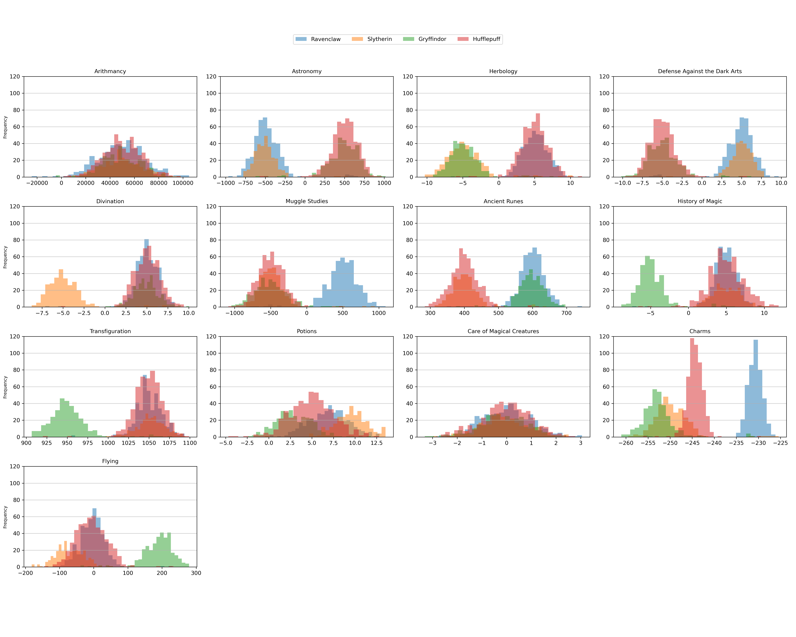

# ft_logistic_regression
Data Science × Logistic Regression - "Harry Potter and the Data Scientist"

## Overview
ft_logistic_regression is an outercore project from 42 — a specialization project available once the Common Core is completed — belonging to the Algorithms, Artificial Intelligence and Data Science track. I must train a one-vs-all logistic regression multiclassifier, using gradient descent, on a multivariate dataset of 1,600 students. The classifier must reach a minimum accuracy score of 98%, according to scikit-learn's `accuracy_score`. At evaluation time, I must be able to explain how the machine learning model works.

Before implementing the multiclassifier, some data analysis and visualization are required. The repository is organized as:
- `Analysis/` — a from-scratch reimplementation of `pandas.DataFrame.describe()` (`describe.py`), plus a pandas-based reference version (`describe_pandas.py`) used to validate it.
- `Visualization/` — exploratory plots over the training data: `histogram.py`, `scatter.py`, `pair_plot.py`.
- `Regression/` — `logreg_train.py` and `logreg_predict.py`, which train and run the logistic regression model.
- `Bonus/` — additional `describe()` statistics beyond the mandatory scope.
- `docs/` — the project subject (`en.subject.pdf`) and `linear_regression.md`, a from-first-principles derivation of the cost function and gradient that the model is built on.
- `datasets/` — the training and test CSVs.
- `aux_funcs/` — shared helper functions.

Run `make help` to see all available commands: setting up the Python environment, running the descriptive-statistics and visualization scripts, and training/predicting with the model.

## Data Analysis

I figured out the data structure supporting my describe() output as a Pandas DataFrame. So I created a Zero-filled DataFrame whose index labels had the name of the calculated statistic.

```python
df = pd.read_csv(dataset_path)
desc_index = ['count', 'unique', 'top', 'freq', 'mean', 'std', 'min', '25%', '50%', '75%', 'max']
desc_columns = df.columns.tolist()
desc= pd.DataFrame(np.zeros((len(desc_index), len(desc_columns))), index=desc_index, columns=desc_columns)
# Initialize an empty DataFrame for descriptive stats
```

### top
I started this calculation with a discrepancy from Pandas' describe() output. My first approach returned `Allan` as the top/most frequent value with two occurrences. This contradicted Pandas' official describe() output, which returned `Nathanael`.

Pandas' describe() tie-breaks with first-seen order. This is the same behaviour as the `Counter` class from the `collections` library, which I used.
```python
counter = Counter(data)
most_common = counter.most_common(1)
return most_common[0][0] if most_common else None
```
My mistake was that I had sorted the feature's values for the numeric ones. I was also using the sorted values for the categorical features. It was incorrect.

At this point, I realised that using the Counter class might be considered cheating, so I refactored the code.

```python
stat={}
for e in data:
    stat[e] = stat.get(e, 0) + 1
stat_sorted = sorted(stat.items(), key=lambda item: item[1],reverse=True)
unique_count = len(stat_sorted)
top_value = stat_sorted[0][0]
frequency = stat_sorted[0][1]
return (unique_count, top_value, frequency)
```


### Standard deviation
Heads up here. I got a difference of 0.144608 from the std calculated by the original pandas DataFrame describe() method.

By default, pandas' `.std()` (and `.describe()`, which calls it internally) computes the sample standard deviation, dividing by `N-1` instead of `N`.

#### 1.-Mean
$$\bar{x}= \frac{1}{n} \sum_{i=1}^{n} x_i$$
```python
mean = sum(data) / n
```

#### 2.-Deviations from the mean
$$d_i = x_i - \bar{x}, \quad i = 1, \quad \dots \quad, n$$


```python
v_minus_mean = [x - mean for x in data]
```

#### 3.-Squared deviations
$$d_i^2 = (x_i - \bar{x})^2$$
```python
squared_minus_mean = [x * x for x in v_minus_mean]
```

#### 4.- Sample standard deviation (n - 1) vs Population standard deviation (n)


##### 4a.- Sample standard deviation (n - 1)
I got 115.614301, the right value.

$$s^2 = \frac{1}{n - 1} \sum_{i=1}^{n}(x_i - \bar{x})^2$$
```python
ft_mean(squared_minus_mean, n - 1)
```

##### 4b.- Population standard deviation (n)
I got 115.469693, a small error.

$$s^2 = \frac{1}{n} \sum_{i=1}^{n}(x_i - \bar{x})^2$$
```python
ft_mean(squared_minus_mean, n)
```

## Visualization
### Histogram
`Visualization/histogram.py` draws one histogram per course, overlaying all four Hogwarts houses on the same axes so their score distributions can be compared at a glance. For each of the 13 courses, it plots each house's grades as a semi-transparent histogram on its own subplot, sharing a single legend and a common y-axis scale (capped at 120) across the whole grid for a fair comparison.

With this chart we can answer the subject question: Which Hogwarts course has a homogeneous score distribution between all four houses?



The goal is to spot, visually, which course has a score distribution that looks the same across all four houses — such a course carries little information for telling the houses apart and would make a poor feature for the classifier.

The answer is: "Aritmancy" and "Care of magical creatures" are courses with homogeneous score distribution in the four houses.

Run it with `make histogram` (uses `datasets/dataset_train.csv`), or directly via `python3 Visualization/histogram.py <dataset_file>`.
### Scatter plot
### Pair plot